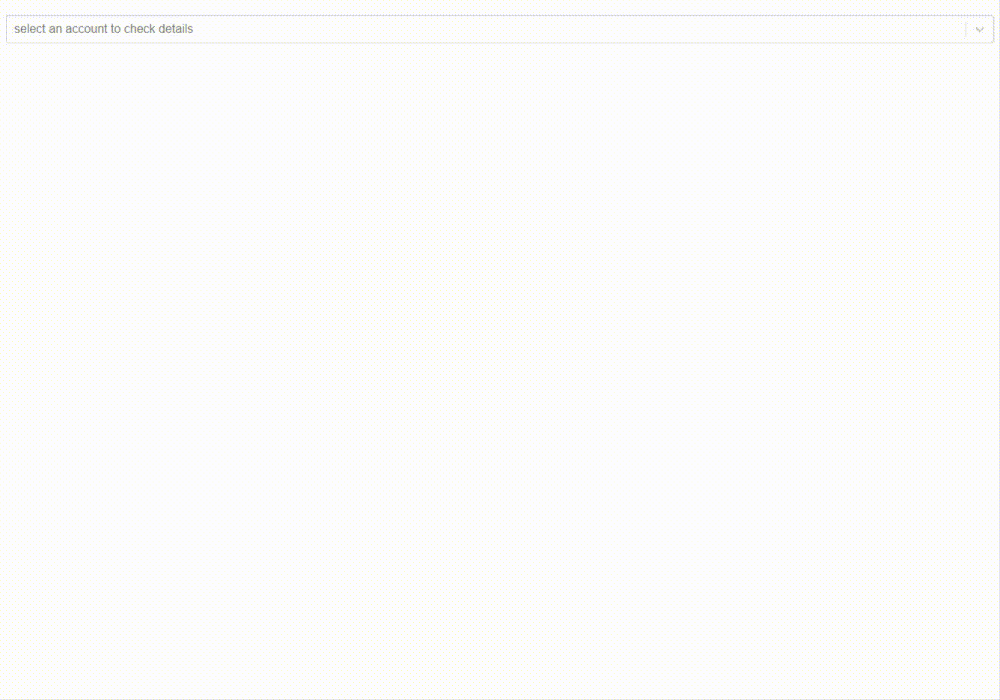

# PressCentric - Test
Test assignment from PressCentric. The objective is to build a simple GD (GET & DELETE) app that consumes 
PressCentric API.

## Prerequisites
Make sure your env has the below software  
```
Node.js
yarn
```

## Getting Started
```
git clone https://github.com/tomliangg/presscentric.git
cd presscentric
yarn install
npm start
```

## Built with
* **React** - Frontend Framework  
* **Material-UI** - Components Design
* **styled-components** - CSS Framework
* **ESLint** - Lint Style
* **Jest & Enzyme** - Unit Test

## APIs
* https://dev.presscentric.com/test/accounts - GET endpoints to retrieve the account lists
* https://dev.presscentric.com/test/accounts/<account_id> - GET and DELETE endpoints for a specific account

## Test

```
npm run test
npm run lint
```

## Demo
Deployed app@ https://trusting-kalam-b9d290.netlify.com/  

